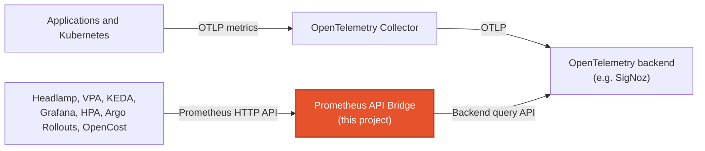

  

<h1 align="center">Prometheus API Bridge</h1>

  🦫 Let Prometheus-only tools query OpenTelemetry metrics without running Prometheus.

## The problem

OpenTelemetry can send Kubernetes and application metrics to systems such as
SigNoz, but many Kubernetes tools still cannot query those systems directly.
They expect the Prometheus HTTP API.

Running Prometheus only for that compatibility has a real cost:

- the same metrics are collected and stored twice;
- another stateful system must be upgraded, scaled, secured, and backed up;
- dashboards and autoscalers can disagree because they query different stores.

## The solution

Prometheus API Bridge runs a small stateless
[Go HTTP server](src/bridge/api/server.go) between Prometheus-only software and an
OpenTelemetry metrics backend. The server implements the Prometheus read API,
sends each query through the configured backend adapter, and returns a
Prometheus-compatible response. Tools keep using the API they already support,
while metrics continue to live only in the existing backend.

The two paths are independent:

- Applications and Kubernetes metrics reach the backend through the normal
  OpenTelemetry pipeline. The bridge does not proxy telemetry ingestion.
- Prometheus API consumers send read requests to the bridge. A stateless
  backend adapter executes those requests against the existing store.

As a query compatibility layer rather than a general-purpose Prometheus
replacement, the bridge exposes the query, range-query, and metadata discovery
endpoints used by the verified integrations below. It preserves the original
PromQL when the backend supports native PromQL and explicitly rejects
unsupported queries. The chart can optionally supply Collector configuration
for Kubernetes metrics missing from the normal pipeline.

## Current compatibility

### Backends

| Backend | Status | Query path |
| --- | --- | --- |
| SigNoz | Supported and tested live | Original PromQL through the SigNoz Prometheus query API |

The backend interface is extensible, but new adapters must preserve the
Prometheus semantics they claim. Contributions adding new backends are
welcome.

### Prometheus API

| Endpoint | Methods | Purpose |
| --- | --- | --- |
| `/api/v1/query` | GET, POST | Instant, scalar, and range-selector queries |
| `/api/v1/query_range` | GET, POST | Range queries |
| `/api/v1/series` | GET, POST | Series discovery |
| `/api/v1/labels` | GET, POST | Label-name discovery |
| `/api/v1/label/<name>/values` | GET, POST | Label-value discovery |
| `/api/v1/status/buildinfo` | GET | Consumer compatibility probe |
| `/-/healthy`, `/-/ready` | GET | Process health |

This is the read surface required by the verified integrations. It is not the
full Prometheus server API. Contributions that expand compatibility are
welcome.

## Authors

- **Simone Primarosa** - [simonepri](https://github.com/simonepri)

See also the list of
[contributors](https://github.com/simonepri/prometheus-api-bridge/contributors)
who participated in this project.

## License

This project is licensed under the MIT License. See the [LICENSE](LICENSE) file
for details.
