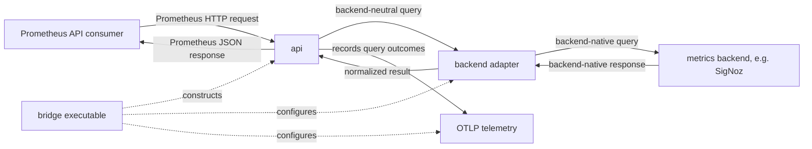

<p align="center">
  <a href="https://github.com/simonepri/prometheus-api-bridge">
    
  </a>
</p>

<h1 align="center">Prometheus API Bridge</h1>

<p align="center">
  <!-- Implementation -->
  <!-- Language - Go -->
  <a href="https://go.dev/">
    
  </a>
  <!-- Telemetry - OpenTelemetry -->
  <a href="https://opentelemetry.io/">
    
  </a>
  <!-- Toolchain - mise -->
  <a href="https://mise.jdx.dev/">
    
  </a>
  <br>
  <!-- Verification -->
  <!-- CI - GitHub Actions -->
  <a href="https://github.com/simonepri/prometheus-api-bridge/actions/workflows/ci.yml">
    
  </a>
  <!-- E2E tests - Chainsaw -->
  <a href="https://kyverno.github.io/chainsaw/">
    
  </a>
  <!-- Test cluster - Kind -->
  <a href="https://kind.sigs.k8s.io/">
    
  </a>
  <br>
  <!-- Distribution -->
  <!-- Release - Release Please -->
  <a href="https://github.com/googleapis/release-please">
    
  </a>
  <!-- Packaging - Helm -->
  <a href="https://helm.sh/">
    
  </a>
  <!-- Container - Docker -->
  <a href="https://www.docker.com/">
    
  </a>
  <!-- License - MIT -->
  <a href="LICENSE">
    
  </a>
</p>

<p align="center">
  🦫 Let Prometheus-only tools query OpenTelemetry metrics without running Prometheus.
</p>

## The problem

OpenTelemetry can send Kubernetes and application metrics to systems such as
SigNoz, but many Kubernetes tools still cannot query those systems directly.
They expect the Prometheus HTTP API.

Running Prometheus only for that compatibility has a real cost:

- the same metrics are collected and stored twice;
- another stateful system must be upgraded, scaled, secured, and backed up;
- dashboards and autoscalers can disagree because they query different stores.

## The solution

Prometheus API Bridge runs a small stateless
[Go HTTP server](src/bridge/api/server.go) between Prometheus-only software and an
OpenTelemetry metrics backend. The server implements the Prometheus read API,
sends each query through the configured backend adapter, and returns a
Prometheus-compatible response. Tools keep using the API they already support,
while metrics continue to live only in the existing backend.


The two paths are independent:

- Applications and Kubernetes metrics reach the backend through the normal
  OpenTelemetry pipeline. The bridge does not proxy telemetry ingestion.
- Prometheus API consumers send read requests to the bridge. A stateless
  backend adapter executes those requests against the existing store.

As a query compatibility layer rather than a general-purpose Prometheus
replacement, the bridge exposes the query, range-query, and metadata discovery
endpoints used by the verified integrations below. It preserves the original
PromQL when the backend supports native PromQL and explicitly rejects
unsupported queries. The chart can optionally supply Collector configuration
for Kubernetes metrics missing from the normal pipeline.

## Current compatibility

### Backends

| Backend | Status | Query path |
| --- | --- | --- |
| SigNoz | Supported and tested live | Original PromQL through SigNoz's Prometheus-compatible `/api/v1/query*` endpoints |

The backend interface is extensible, but new adapters must preserve the
Prometheus semantics they claim. Contributions adding new backends are
welcome.

The SigNoz adapter currently requires
[`/api/v1/query`](https://github.com/SigNoz/signoz/blob/v0.137.0/pkg/query-service/app/http_handler.go#L486)
and
[`/api/v1/query_range`](https://github.com/SigNoz/signoz/blob/v0.137.0/pkg/query-service/app/http_handler.go#L485).
Both routes are present and tested in SigNoz 0.137.0.

### Prometheus API

| Endpoint | Methods | Purpose |
| --- | --- | --- |
| `/api/v1/query` | GET, POST | Instant, scalar, and range-selector queries |
| `/api/v1/query_range` | GET, POST | Range queries |
| `/api/v1/series` | GET, POST | Series discovery |
| `/api/v1/labels` | GET, POST | Label-name discovery |
| `/api/v1/label/<name>/values` | GET, POST | Label-value discovery |
| `/api/v1/status/buildinfo` | GET | Consumer compatibility probe |
| `/-/healthy`, `/-/ready` | GET | Process health |

This is the read surface required by the verified integrations. It is not the
full Prometheus server API. Contributions that expand compatibility are
welcome.

### Verified integrations

The project is tested end to end with common software that expects Prometheus.
Each integration uses the tool's normal Prometheus configuration and the same
bridge URL. There are no consumer-specific bridge modes.

This table is a compatibility overview. After installing the bridge, use
**View configuration** for the exact Helm values, Kubernetes resources, and
Chainsaw assertions behind each tested integration.

| Tool | Configuration provided | What it enables | Reference |
| --- | --- | --- | --- |
| Headlamp | [Prometheus plugin](https://github.com/headlamp-k8s/plugins/tree/main/prometheus) pointing at the bridge | Workload CPU, memory, network, filesystem, and volume charts | [View configuration](src/tests/headlamp/) |
| Vertical Pod Autoscaler | [VPA Prometheus history provider](https://github.com/kubernetes/autoscaler/blob/master/vertical-pod-autoscaler/docs/components.md#running-the-recommender) pointing at the bridge | Resource recommendations from durable usage history | [View configuration](src/tests/vpa/) |
| KEDA | [KEDA Prometheus scaler](https://keda.sh/docs/2.21/scalers/prometheus/) with its server address set to the bridge | Event-driven scaling from OpenTelemetry metrics | [View configuration](src/tests/keda/) |
| Grafana | [Grafana Prometheus data source](https://grafana.com/docs/grafana/latest/datasources/prometheus/configure/) provisioned with the bridge URL | Dashboards and ad hoc queries over OpenTelemetry metrics | [View configuration](src/tests/grafana/) |
| Ray | [Ray Dashboard](https://docs.ray.io/en/latest/cluster/metrics.html) using the bridge as its Prometheus-compatible query API | Ray Dashboard health checks, system metrics, and Grafana-backed time-series views | [View configuration](src/tests/ray/) |
| Horizontal Pod Autoscaler | [Prometheus Adapter Helm values](https://github.com/prometheus-community/helm-charts/tree/main/charts/prometheus-adapter) and [metric rules](https://github.com/kubernetes-sigs/prometheus-adapter/blob/master/docs/config.md) targeting the bridge | Kubernetes autoscaling from custom OpenTelemetry metrics | [View configuration](src/tests/hpa/) |
| Argo Rollouts | [Argo Rollouts Prometheus analysis provider](https://argo-rollouts.readthedocs.io/en/stable/analysis/prometheus/) pointing at the bridge | Metric-driven rollout analysis and promotion | [View configuration](src/tests/argo-rollouts/) |
| OpenCost | [OpenCost Prometheus data source](https://github.com/opencost/opencost-helm-chart/blob/main/charts/opencost/README.md) configured with the bridge URL | Kubernetes cost allocation without a Prometheus server | [View configuration](src/tests/opencost/) |

Every integration above is exercised by the
[end-to-end suite](src/tests/suite/chainsaw-test.yaml) with
[Kind](https://kind.sigs.k8s.io/) and
[Chainsaw](https://kyverno.io/docs/subprojects/chainsaw/) against a real SigNoz
installation.

## Install with SigNoz

Requirements:

| Dependency | Requirement | Tested version |
| --- | --- | --- |
| Kubernetes | No minimum version claimed yet | 1.36.1 |
| Helm | 3.8 or newer for OCI chart support | 4.2.4 |
| SigNoz | Prometheus-compatible query endpoints and service-account API keys | 0.137.0 |

The Kubernetes and SigNoz entries state the versions exercised by the live
suite. Broader version ranges have not yet been verified.

At runtime, the bridge needs network access to the SigNoz query API and a
read-only service-account API key. An OTLP/HTTP endpoint is optional and is
used only to export the bridge's own operational metrics.

The bridge reads its SigNoz API key and its client bearer token from Kubernetes
Secrets. For a direct Helm setup, create the namespace and Secrets with
`kubectl`:

```sh
kubectl create namespace observability
kubectl -n observability create secret generic prometheus-api-bridge-signoz --from-literal=api-key="$SIGNOZ_API_KEY"
kubectl -n observability create secret generic prometheus-api-bridge-auth --from-literal=token="$BRIDGE_BEARER_TOKEN"
```

The OCI chart contains the templates, defaults, and value schema. Your
deployment must provide the SigNoz URL and reference a credential Secret that
already exists in the target cluster:

```yaml
backend:
  type: signoz
  signoz:
    url: https://signoz.example.com
    apiKeySecret:
      name: prometheus-api-bridge-signoz
      key: api-key
server:
  auth:
    bearerTokenSecret:
      name: prometheus-api-bridge-auth
      key: token
```

If you deploy directly with Helm, save those overrides as `values.yaml` and
install a pinned release:

```sh
helm upgrade --install prometheus-api-bridge oci://ghcr.io/simonepri/charts/prometheus-api-bridge --version 0.1.0 --namespace observability --values values.yaml
```

With Argo CD, Flux, Terraform, or another IaC system, reference the same OCI
chart and supply the same values in its release definition. Keep the API key in
a Kubernetes Secret or external secret manager, not in chart values.

Consumers inside the cluster can now query:

```text
http://prometheus-api-bridge.observability.svc:9090
```

Verify the endpoint locally:

```sh
kubectl -n observability port-forward service/prometheus-api-bridge 9090:9090
curl -fsS http://localhost:9090/-/ready
curl -fsSG http://localhost:9090/api/v1/query --header "Authorization: Bearer $BRIDGE_BEARER_TOKEN" --data-urlencode 'query=up'
```

The bridge can only return metrics present in SigNoz. If the required
Kubernetes or exporter metrics are missing, use the chart's
[collection settings](src/chart/values.yaml). The chart can extend an existing
Collector or install a dedicated one. The
[existing Collector example](src/tests/collector/existing.yaml) shows how the
generated configuration is merged into a Collector you already operate.

## Connect a consumer

Once the bridge readiness endpoint responds, choose a consumer from the
[verified integrations](#verified-integrations) and use its **View
configuration** link as the starting point for your deployment. Each reference
shows the consumer's bridge URL, required metrics, and supporting Kubernetes
resources.

## Bridge chart configuration

The commented [`values.yaml`](src/chart/values.yaml) is the configuration
reference. [`values.schema.json`](src/chart/values.schema.json) validates every
supported value and rejects unknown fields.

| Values | Purpose |
| --- | --- |
| `backend.*` | Select and authenticate the metrics backend |
| `server.image`, `server.replicas`, `server.resources` | Configure the bridge workload |
| `server.auth.*` | Authenticate Prometheus API clients, or explicitly acknowledge unauthenticated mode |
| `server.telemetry.*` | Export bridge operational metrics over OTLP/HTTP |
| `server.queryTimeout`, `server.max*` | Bound query cost, concurrency, and response size |
| `server.strategy`, `server.podDisruptionBudget`, `server.topologySpread` | Configure rollout and availability behavior |
| `service.*` | Configure the Prometheus-compatible Service |
| `networkPolicy.*` | Restrict pod access to an explicitly selected set of consumers |
| `collection.*` | Disable collection, extend an existing Collector, or install a dedicated Collector |
| `kube-state-metrics.*` | Configure the optional kube-state-metrics dependency |

Use a read-only backend credential. Configured empty or unreadable Secrets fail
startup rather than silently disabling authentication. Health endpoints remain
unauthenticated.

Bearer authentication is enabled by default. For a consumer that cannot attach
authorization headers, set `server.auth.allowUnauthenticated=true`, clear
`server.auth.bearerTokenSecret.name`, and restrict the bridge with
`networkPolicy.ingress` or an equivalent network control. The chart intentionally
exposes only a `ClusterIP`; put an authenticated, TLS-terminating ingress or
service mesh in front of it rather than changing the Service to public access.

Bridge telemetry uses the `prometheus_api_bridge_*` namespace. Query
expressions and metric names are never exported as telemetry attributes.

## Development and release

Mise is the public task interface:

```sh
mise install
mise run verify
mise run e2e
```

`mise run verify` runs formatting checks, strict Go linting, race-enabled unit
tests, Helm schema and render checks, chart packaging, Chainsaw validation,
JSON Schema validation, Dockerfile linting, GitHub Actions linting and security
analysis, YAML linting, secret scanning, and reachable Go vulnerability checks.

The integration suite is organized under `src/tests/<consumer>`. One shared
Kind and SigNoz environment verifies the complete matrix sequentially and is
deleted on success or failure. Pinned Helm artifacts and VPA source are reused
from `~/.cache/prometheus-api-bridge` locally and in CI.

### Repository layout

```text
prometheus-api-bridge/
├── .config/               # Linter and release configuration
├── .github/               # CI and release workflows
├── mise.toml              # Tool versions and public development tasks
└── src/                   # Go module and shipped project artifacts
    ├── bridge/            # Go server implementation
    │   ├── main.go        # Executable configuration and lifecycle
    │   ├── api/           # Prometheus-compatible HTTP API
    │   ├── backend/       # Query contract and backend adapters
    │   │   └── signoz/    # SigNoz backend adapter
    │   └── telemetry/     # Native OTLP bridge telemetry
    ├── chart/             # Production Helm chart
    ├── tests/             # Shared Kind and Chainsaw integration suite
    ├── Dockerfile         # Production bridge container image
    ├── go.mod
    └── go.sum
```

The diagram below shows how a Prometheus query reaches the metrics backend and
how the result returns to the consumer:



- `bridge` contains the complete Go server. Its `main.go` loads configuration
  and credentials, selects a backend, starts the API, and handles shutdown.
- `bridge/api` implements the supported Prometheus HTTP endpoints, validation,
  authentication, response encoding, and operational limits.
- `bridge/backend` defines normalized query and series types. Backend-specific
  clients implement that Go interface under `bridge/backend/<name>`, and
  `main.go` injects the selected client into the API. The interface adds no
  runtime network hop.
- `bridge/telemetry` implements the API observer used to export query counts,
  latency, errors, and concurrency over OTLP. It never queries the backend.
- `chart` packages the server, collection configuration, RBAC, and optional
  kube-state-metrics dependency for production installation.
- `tests/<consumer>` colocates each verified integration's Chainsaw steps,
  Kubernetes resources, and Helm values. All consumers share one Kind cluster.

Go tests stay beside the package they verify, following the standard
`file.go` and `file_test.go` convention. `src` is both the Go module root and
the container build context, so application code and shipped deployment
artifacts have one source boundary.

### Demo the integrations

The demo creates one Kind cluster, installs SigNoz and every verified
integration, runs the end-to-end checks, and leaves the working cluster
available for inspection:

```sh
mise run demo-up
```

Start each HTTP endpoint in a separate terminal:

| Service | Command | Local endpoint |
| --- | --- | --- |
| Bridge | `mise run demo-bridge` | `http://localhost:9090` |
| SigNoz | `mise run demo-signoz` | `http://localhost:3301` |
| Headlamp | `mise run demo-headlamp` | `http://localhost:4466` |
| Grafana | `mise run demo-grafana` | `http://localhost:3000` |
| OpenCost API | `mise run demo-opencost` | `http://localhost:9003` |

`demo-headlamp` prints a short-lived viewer token before starting its port
forward. The SigNoz demo login is `admin@bridge.test` with password
`BridgeTest123$`. Grafana permits anonymous access in the demo only.

Useful requests:

```sh
curl -fsSG http://localhost:9090/api/v1/query --data-urlencode 'query=bridge_test_queue_depth'
curl -fsS 'http://localhost:9003/allocation?window=10m&aggregate=namespace&resolution=1m'
```

KEDA, HPA, VPA, and Argo Rollouts are controllers rather than standalone HTTP
servers. Inspect their verified resources in the same cluster:

```sh
mise run demo-status
```

Delete the retained environment when finished:

```sh
mise run demo-down
```

Release Please creates version tags without a changelog file. A tag publishes
multi-architecture, provenance-attested images and the OCI Helm chart from the
exact tagged commit.

## Authors

- **Simone Primarosa** - [simonepri](https://github.com/simonepri)

See also the list of
[contributors](https://github.com/simonepri/prometheus-api-bridge/contributors)
who participated in this project.

## License

This project is licensed under the MIT License. See the [LICENSE](LICENSE) file
for details.
